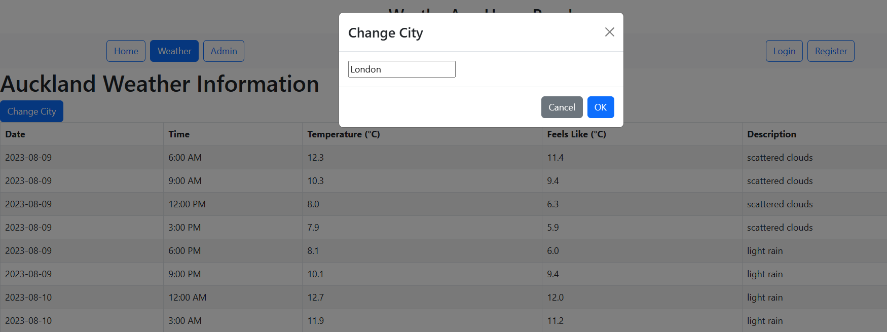
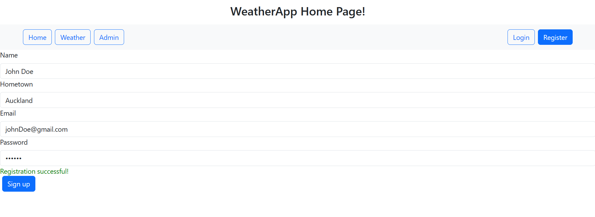

# Weather App

The Weather App is a web application built using TypeScript, React, Redux, and React Bootstrap for the frontend. It utilizes .NET 7 for the backend and integrates with Azure Microsoft SQL Server Management Studio for data storage. Firebase is used for user authentication, generating tokens during user registration for backend authentication.

## Technologies Used

- **Frontend:**
  - TypeScript
  - React
  - Redux (for login sessions)
  - React Bootstrap

- **Backend:**
  - .NET 7
  - Microsoft SQL Server Management Studio

- **Authentication:**
  - Firebase

- **Database:**
  - Azure Database (Microsoft SQL Server)

## Features

1. **Weather Information:**
   - Users can fetch weather information based on their input (city/ location).
   - Weather data is displayed dynamically, allowing users to track current weather conditions.


2. **User Authentication:**
   - User registration and login functionality are fully implemented.
   - Firebase is used for authentication, generating tokens during user registration which are passed into the backend.
   - User information is securely stored in the database and authenticated on the backend.


3. **Admin Panel for User Management:**
   - An admin panel is available to authorized users.
   - Admins can perform actions like modifying and deleting user information.


## Getting Started

1. **Clone the repository:**

2. **Install Dependancies**
```bash
cd frontend
npm install

cd ../backend
dotnet restore
```

3. **Configure Frontend API Endpoint:**
   - Open "frontend/my-app/src/api/ApiBackend.tsx"
   - Find the BASE_URL variable and update it to your local backend server's URL (e.g., http://localhost:5000).
  
4. **Set Up Firebase for Backend:**
   - Create a Firebase account if you don't have one.
   - Generate a private key for your Firebase project, saving it as "auth-phase2-firebase-adminsdk.json".
   - Place this JSON file in the "backend/src" directory.

5. **Run the Application:
   - Start the frontend:
```bash
cd frontend
npm start
```
   - Start the backend:
```bash
cd backend
dotnet run
```

  
